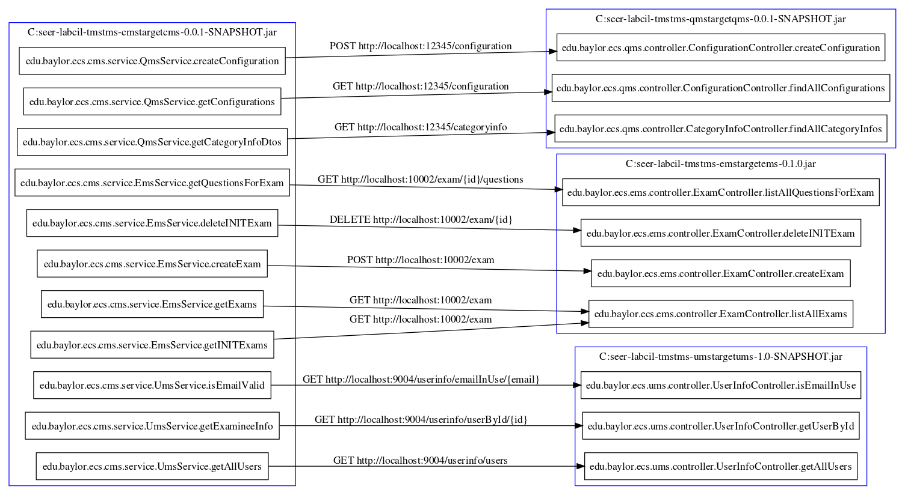

# Rest API Discovery

This project discovers the rest-endpoints and rest-clients from the bytecode of a microservice. Given a set of compiled microservice artifacts, it can also generate a rest flow graph among those endpoints and clients.


To get started clone the Github [repository](https://github.com/cloudhubs/rad).

```
$ git clone https://github.com/cloudhubs/rad.git
```

## Major Dependencies

- [Spring boot](https://spring.io/projects/spring-boot)
- [Javassist](https://github.com/jboss-javassist/javassist)
- [Local weaver](https://bitbucket.org/cilab/local-weaver/src/master/) (`rest` branch)
- [Apache commons](https://mvnrepository.com/artifact/org.apache.commons)
- [Lombok](https://projectlombok.org/)

## Core components

1. **Analyzer:** Analyzes a `CtClass` object and detects all `RestEntity` in that class. Currently there are four different analyzer: `JaxRSAnalyzer`, `SpringEndpointAnalyzer`, `SpringClientAnalyzer`, and `SpringClientWrapperAnalyzer`.

2. **Instruction scanner:** Scans the bytecode instructions of a `CtMethod` and creates a list of simplified `InstructionInfo`.

3. **Dataflow:** Detects rest client method calls along with URL and return type. It takes a list of `InstructionInfo` and performs backward dataflow analysis.

4. **Flow matcher:** Find pairs of server and client `RestEntity` by matching HTTP method, URL, and other properties.

5. **Graph generator:** Generates a [graphviz](https://www.graphviz.org/) file to visualize rest communication between microservices. 


## Run the Application

### Prepare the `Local weaver` library

```
$ git clone https://{username}@bitbucket.org/cilab/local-weaver.git
$ cd local-weaver
$ git checkout rest
$ mvn clean install -DskipTests
```

### Prepare the test bed 

We will use [CIL-TMS](https://bitbucket.org/cilab/cil-tms/src/master/) (`rad` branch) as our test bed.

```
$ git clone https://{username}@bitbucket.org/cilab/cil-tms.git
$ cd cil-tms
$ git checkout rad
```

Package each microservice.

```
$ cd tms-cms && mvn clean install -DskipTests
$ cd ../tms-ems && mvn clean install -DskipTests
$ cd ../tms-qms && mvn clean install -DskipTests
$ cd ../tms-qms && mvn clean install -DskipTests
```

### Compile and run the application

```
$ git clone https://github.com/cloudhubs/rad.git
$ cd rad
$ mvn clean install -DskipTests
$ java -jar application/target/rad-application-0.0.5.jar
```

### Sample request and response

```
curl --request POST \
  --url http://localhost:8080/ \
  --header 'content-type: application/json' \
  --data '{
    "pathToCompiledMicroservices":"C:\\seer-lab\\cil-tms",
    "organizationPath":"edu/baylor/ecs",
    "outputPath":"C:\\seer-lab\\cil-rad.gv"
}'
```

```yaml
{
  "request": {
    "pathToCompiledMicroservices": "C:\\seer-lab\\cil-tms",
    "organizationPath": "edu/baylor/ecs",
    "outputPath": "C:\\seer-lab\\cil-rad.gv"
  },
  "restEntityContexts": [
    {
      "resourcePath": "C:\\seer-lab\\cil-tms\\tms-cms\\target\\cms-0.0.1-SNAPSHOT.jar",
      "restEntities": [
        {
          "url": "http://localhost:10003/categoryInfo",
          "applicationName": null,
          "ribbonServerName": null,
          "resourcePath": "C:\\seer-lab\\cil-tms\\tms-cms\\target\\cms-0.0.1-SNAPSHOT.jar",
          "className": "edu.baylor.ecs.cms.controller.CategoryInfoController",
          "methodName": "getCategoryInfo",
          "returnType": "java.util.List<java.lang.Object>",
          "path": "/categoryInfo",
          "httpMethod": "GET",
          "pathParams": null,
          "queryParams": null,
          "consumeType": null,
          "produceType": null,
          "client": false
        },
        ...
      ]
    },
    ...
  ],
  "restFlowContext": {
    "restFlows": [
      {
        "resourcePath": "C:\\seer-lab\\cil-tms\\tms-cms\\target\\cms-0.0.1-SNAPSHOT.jar",
        "className": "edu.baylor.ecs.cms.service.UmsService",
        "methodName": "isEmailValid",
        "servers": [
          {
            "url": "http://localhost:9004/userinfo/emailInUse/{email}",
            "applicationName": null,
            "ribbonServerName": null,
            "resourcePath": "C:\\seer-lab\\cil-tms\\tms-ums\\target\\ums-1.0-SNAPSHOT.jar",
            "className": "edu.baylor.ecs.ums.controller.UserInfoController",
            "methodName": "isEmailInUse",
            "returnType": null,
            "path": "/userinfo/emailInUse/{email}",
            "httpMethod": "GET",
            "pathParams": [
              {
                "name": "VARIABLE_NAME",
                "defaultValue": ""
              }
            ],
            "queryParams": null,
            "consumeType": null,
            "produceType": null,
            "client": false
          }
        ]
      },
      ...
    ]
  }
}
```

### Generated graph



## Integrate as library

### Compile the library

```
$ git clone https://github.com/cloudhubs/rad.git
$ cd rad
$ mvn clean install -DskipTests
```

### Add dependency to your project

```xml
<dependency>
    <groupId>edu.baylor.ecs.cloudhubs</groupId>
    <artifactId>rad</artifactId>
    <version>0.0.5</version>
</dependency>
```

### Code example

```java
@Autowired
private final RestDiscoveryService restDiscoveryService;
   
public RadResponseContext getRadResponseContext(RadRequestContext request) {
    return restDiscoveryService.generateRadResponseContext(request);
}
```

## Core Contexts and Models

### Contexts

```java
public class RadRequestContext {
    private String pathToCompiledMicroservices;
    private String organizationPath;
    private String outputPath;
}
```

```java
public class RadResponseContext {
    private RadRequestContext request;
    private List<SeerRestEntityContext> restEntityContexts = new ArrayList<>();
    private SeerRestFlowContext restFlowContext;
}
```

```java
public class SeerRestEntityContext {
    private String resourcePath;
    private List<RestEntity> restEntities = new ArrayList<>();
}
```

```java
public class SeerRestFlowContext {
    private List<RestFlow> restFlows = new ArrayList<>();
}
```

### Models

```java
public class RestEntity {
    private boolean isClient;

    private String url;

    private String applicationName; // used in eureka discovery
    private String ribbonServerName;

    private String resourcePath;
    private String className;
    private String methodName;
    private String returnType;

    private String path;
    private HttpMethod httpMethod;

    private List<Param> pathParams;
    private List<Param> queryParams;

    private String consumeType; // can be any mime type
    private String produceType; // can be any mime type
}
```

```java
public class RestFlow {
    private String resourcePath;
    private String className;
    private String methodName;

    private List<RestEntity> servers;
}
```
